# Crystal Architecture Documentation

## Overview

Crystal is an Electron desktop application that manages multiple Claude Code instances using git worktrees. This document visualizes the architecture using Mermaid diagrams.

## High-Level Architecture

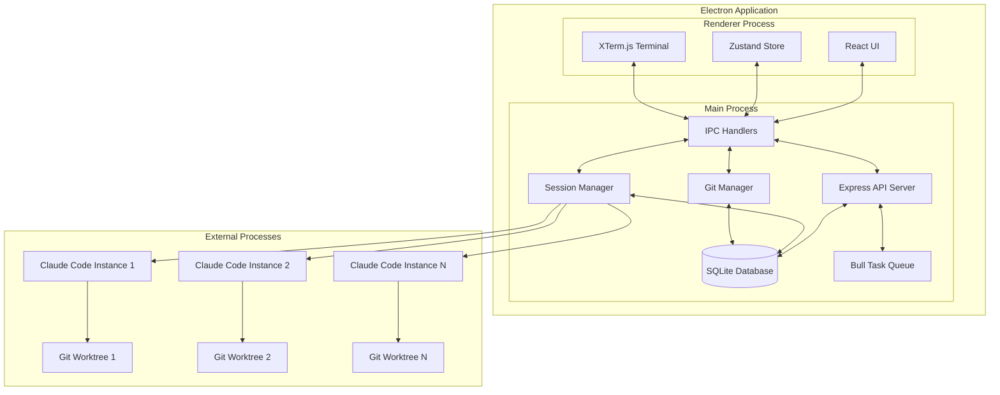

## Component Flow

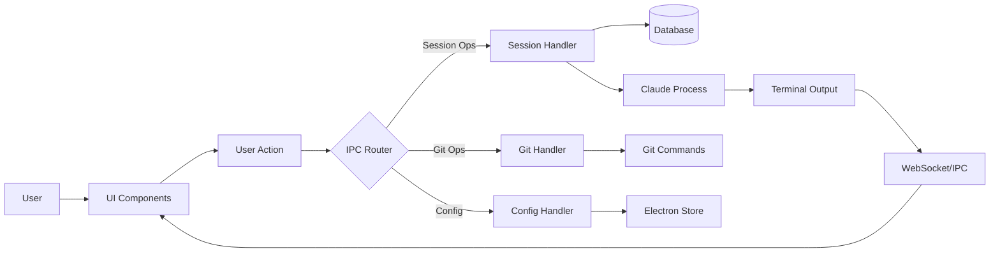

## Database Schema

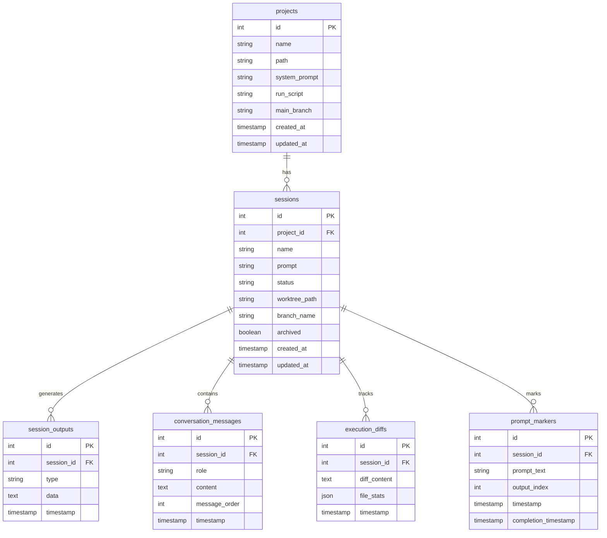

## Session Lifecycle

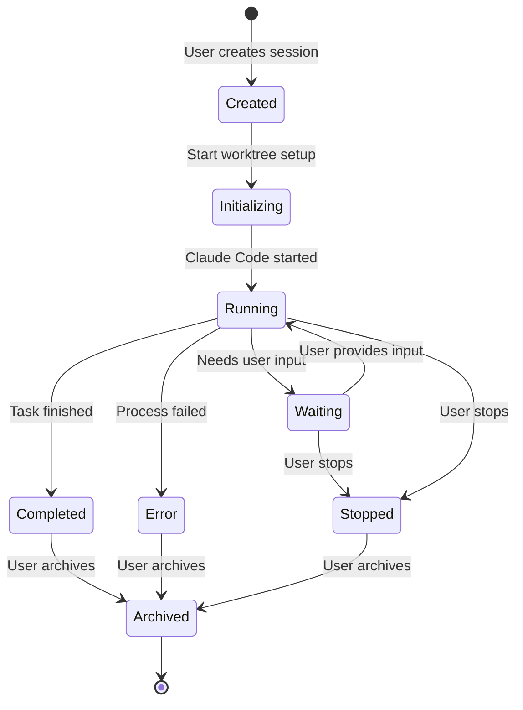

## IPC Communication Flow

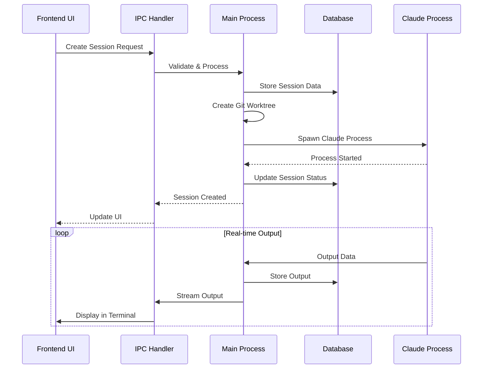

## Frontend Component Hierarchy

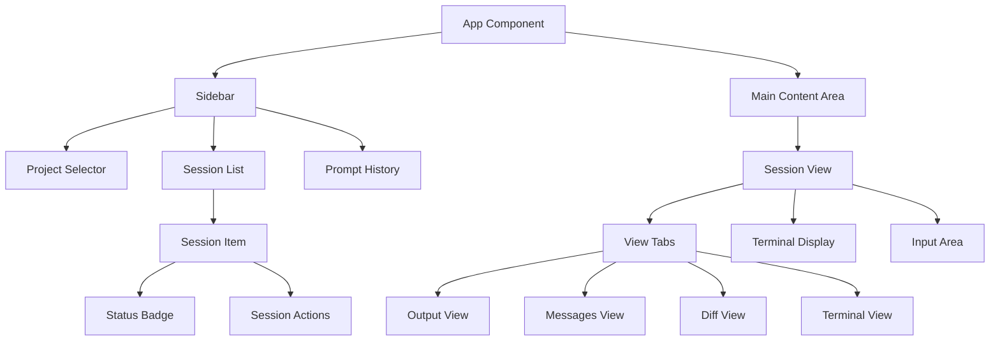

## Data Flow for Session Output

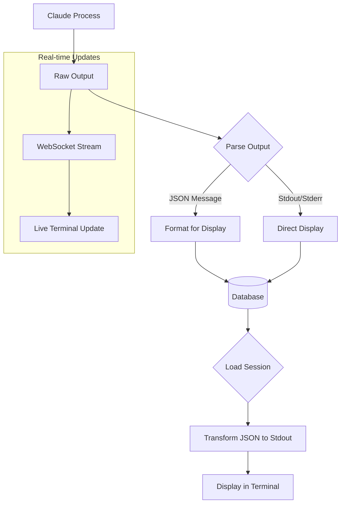

## Git Operations Flow

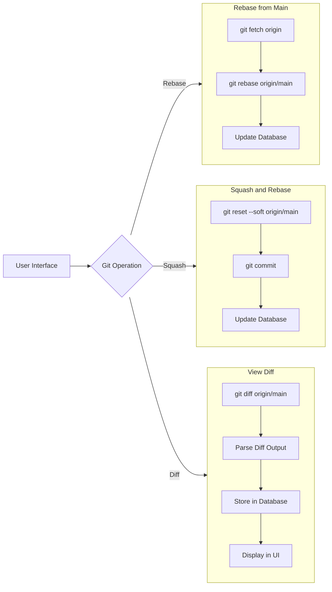

## Task Queue Processing

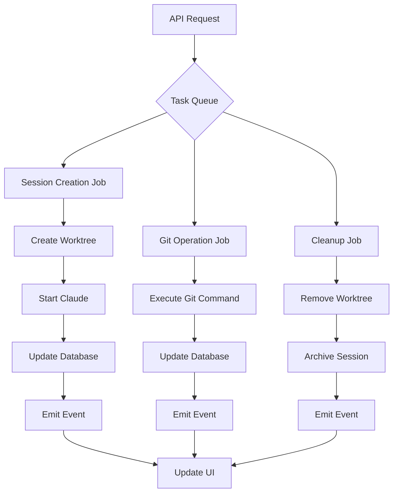

## Module Dependencies

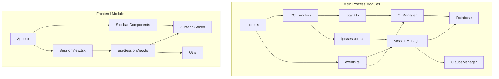

## Security & Isolation

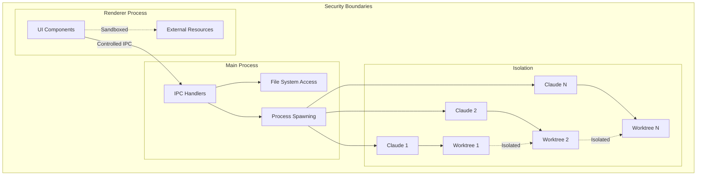

## Performance Optimizations

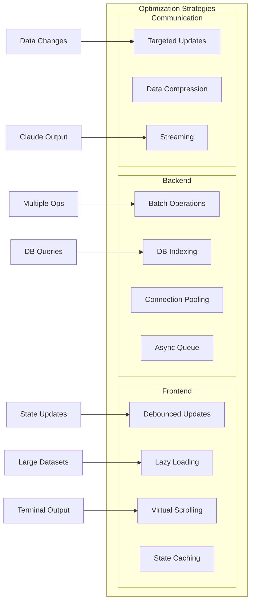

This comprehensive set of Mermaid diagrams illustrates the various aspects of Crystal's architecture, from high-level component relationships to detailed data flows and module dependencies.