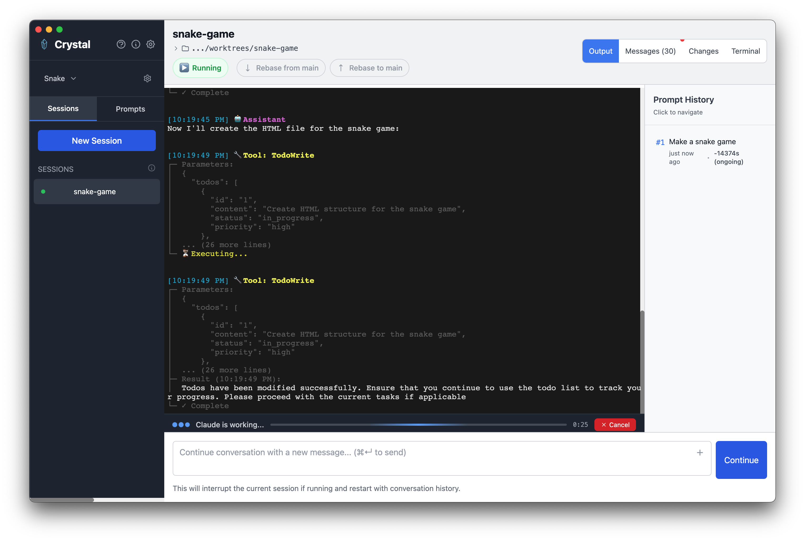
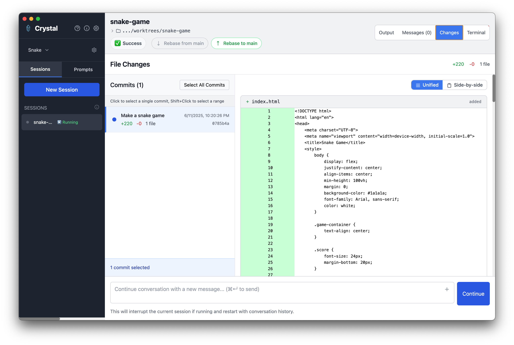
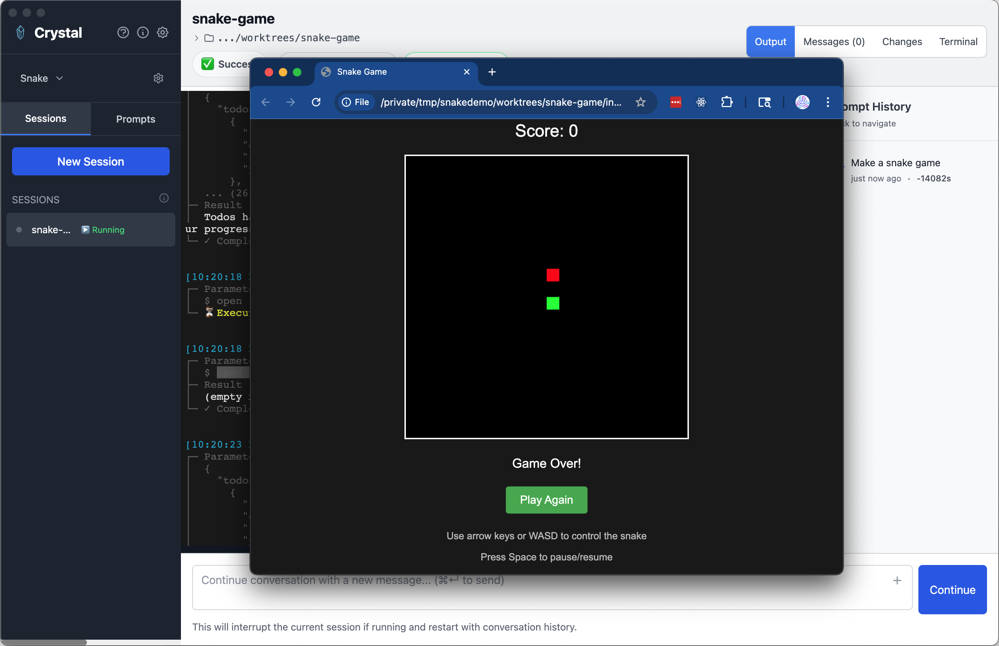

# Crystal - Multi-Session Claude Code Manager

<div align="center">
  <h3><a href="https://github.com/stravu/crystal/releases/latest">**Get the Latest Release Here**</a></h3>
</div>

<div align="center">
  <h2>🌐 Join Our Community</h2>
  <p>Connect with other Crystal users, share your workflows, and get help!</p>
  <a href="https://discord.gg/XrVa6q7DPY">
    
  </a>
</div>

Crystal is an Electron desktop application that lets you run, inspect, and test multiple Claude Code instances simultaneously using git worktrees. Crystal is an independent project created by [Stravu](https://stravu.com/). Stravu is the way AI-first teams collaborate.

<div align="center">
  
  <p><em>Create multiple Claude Code sessions with a simple prompt, each running in its own git worktree</em></p>
  <br>
  
  <table>
    <tr>
      <td align="center" width="50%">
        
        <p><em>Track all changes with built-in git diff viewer showing additions, deletions, and commit history</em></p>
      </td>
      <td align="center" width="50%">
        
        <p><em>Test your code instantly - run your worktree directly from Crystal</em></p>
      </td>
    </tr>
  </table>
</div>

## The Crystal Workflow

1. Create sessions from prompts, each in an isolated git worktree
2. Iterate with Claude Code inside your sessions. Each iteration will make a commit so you can always go back.
3. Review the diff changes and make manual edits as needed
4. Squash your commits together with a new message and rebase to your main branch.

## ✨ Key Features

- **🚀 Parallel Sessions** - Run multiple Claude Code instances at once
- **🌳 Git Worktree Isolation** - Each session gets its own branch
- **💾 Session Persistence** - Resume conversations anytime
- **🔧 Git Integration** - Built-in rebase and squash operations
- **📊 Change Tracking** - View diffs and track modifications
- **🔔 Notifications** - Desktop alerts when sessions need input
- **🏗️ Run Scripts** - Test changes instantly without leaving Crystal

## 🚀 Quick Start

### Prerequisites
- Claude Code installed and logged in or API key provided
- Git installed
- Git repository (Crystal will initialize one if needed)

### 1. Create a Project
Create a new project if you haven't already. This can be an empty folder or an existing git repository. Crystal will initialize git if needed.

### 2. Create Sessions from a Prompt
For any feature you're working on, create one or multiple new sessions:
- Each session will be an isolated git worktree

### 3. Monitor and Test Your Changes
As sessions complete:
- **Configure run scripts** in project settings to test your application without leaving Crystal
- **Use the diff viewer** to review all changes and make manual edits as needed
- **Continue conversations** with Claude Code if you need additional changes

### 4. Finalize Your Changes
When everything looks good:
- Click **"Rebase to main"** to squash all commits with a new message and rebase them to your main branch
- This creates a clean commit history on your main branch

### Git Operations
- **Rebase from main**: Pull latest changes from main into your worktree
- **Squash and rebase to main**: Combine all commits and rebase onto main
- Always preview commands with tooltips before executing


## Installation

### Download Pre-built Binaries

- **macOS**: Download `Crystal-{version}.dmg` from the [latest release](https://github.com/stravu/crystal/releases/latest)
  - Open the DMG file and drag Crystal to your Applications folder
  - On first launch, you may need to right-click and select "Open" due to macOS security settings


## Building from Source

```bash
# Clone the repository
git clone https://github.com/stravu/crystal.git
cd crystal

# One-time setup
pnpm run setup

# Run in development
pnpm run electron-dev
```

## Building for Production

```bash
# Build for macOS
pnpm build:mac
```


## 🤝 Contributing

We welcome contributions! Please see our [Contributing Guidelines](CONTRIBUTING.md) for details.

### Developing Crystal with Crystal

If you're using Crystal to develop Crystal itself, you need to use a separate data directory to avoid conflicts with your main Crystal instance:

```bash
# Set the run script in your Crystal project settings to:
pnpm run setup && CRYSTAL_DIR=~/.crystal_test pnpm electron-dev
```

This ensures:
- Your development Crystal instance uses `~/.crystal_test` for its data
- Your main Crystal instance continues using `~/.crystal` 
- Worktrees won't conflict between the two instances
- You can safely test changes without affecting your primary Crystal setup


## 📄 License

Crystal is open source software licensed under the [MIT License](LICENSE).

### Third-Party Licenses

Crystal includes third-party software components. All third-party licenses are documented in the [NOTICES](NOTICES) file. This file is automatically generated and kept up-to-date with our dependencies.

To regenerate the NOTICES file after updating dependencies:
```bash
pnpm run generate-notices
```

## Disclaimer

Crystal is an independent project created by [Stravu](https://stravu.com/). Claude™ is a trademark of Anthropic, PBC. Crystal is not affiliated with, endorsed by, or sponsored by Anthropic. This tool is designed to work with Claude Code, which must be installed separately.

---

<div align="center">
  
  <br>
  Made with ❤️ by <a href="https://stravu.com/">Stravu</a>
</div>
